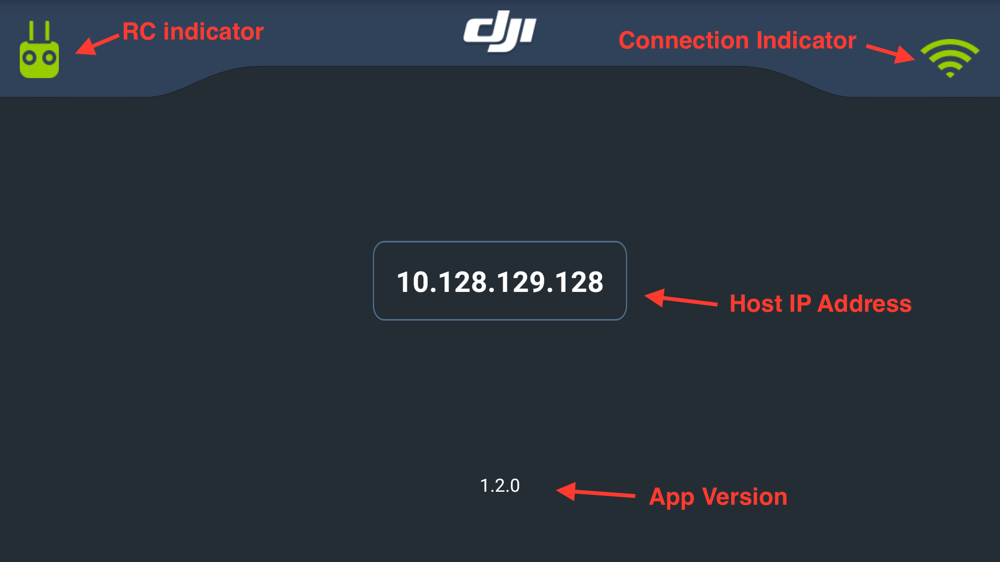

# DroneAndroidBridgeApp

## What is this?

The Drone Android Bridge App allows efficient development of Android applications. 

Many DJI products require the Android device to be connected directly through USB to a remote controller, which means the Android device can only be connected to the PC through WiFi debugging. While workable, development is slow as resource intensive tasks such as profiling or transferring a new build to the mobile device can take a long time. In addition, the Android Studio emulator cannot be used to do any development.

The Android bridge app runs on an Android device connected to the remote controller and accepts a network connection from another Android device running an SDK based application. It acts as a bridge between the remote controller and the Android device running the SDK based application.

This means:

* The Android device running the SDK based application can connect with USB to the PC, while connecting over WiFi to the bridge app
* Or the Android Studio emulator can be used on the PC and connect to the bridge app over WiFi

This makes it easier develop, debug, setup CI environments, share devices in a team, or even do remote development with devices.

## Compatibility

* The Drone Android Bridge App is compatible with the Android DJI Mobile SDK v4.0 and above.
* The Drone Android Bridge App is compatible with all DJI RC

## Setup

When using the bridge app, two Android devices are used (or one device with the bridge app and the emulator):

1. An Android device with the DroneAndroidBridgeApp apk that is connected directly to the remote controller
2. An Android device running an SDK based application

**Both devices** must be able to resolve each other's IP address - and should be **used on the same network**.
Only wi-fi and ethernet connections have been tested to work.

The steps to make the bridge app work are:

* Device 1: 

  * Start the bridge app
  * Connect the Android device to remote controller
  * Grant USB access to the bridge app
  * Make sure the red light in the top left corner of the screen turns green - this shows the bridge app is connected with the DJI product
  * There will be an IP address in the middle of the screen - which is used with the second device.
  
* Device 2:

  * Device 2 should be running a DJI Mobile SDK based application.
  * The IP address of Device 1 should be passed to `enableBridgeModeWithBridgeAppIP` in `SDKManager` to connect with Device 1. `enableBridgeModeWithBridgeAppIP` must be called after the sdk has registered.
```java
new DJISDKManager.SDKManagerCallback() {

        @Override
        public void onRegister(DJIError error) {
            isRegistrationInProgress.set(false);
            if (error == DJISDKError.REGISTRATION_SUCCESS) {
                // ...
                // ADD CALL HERE
                DJISDKManager.getInstance().enableBridgeModeWithBridgeAppIP("YOUR IP");
            } else {
            	// ...
            }
        }
        @Override
        public void onProductDisconnect() {
        	// ...
        }

        @Override
        public void onProductConnect(BaseProduct product) {
        	// ...
        }

        @Override
        public void onComponentChange(BaseProduct.ComponentKey key,
                                      BaseComponent oldComponent,
                                      BaseComponent newComponent) {
          	// ...
        }
    };
```
  * Make sure the red light in the top left corner of Device 2's screen turns green - this shows Device 2 is connected with Device 1.
  * The application can now be run remotely.

## App Features

* Layout: 
 
  

* RC indicator:

  *  No USB device connected to DroneAndroidBridgeApp
  *  Connected device is not supported or not working properly
  *  DJI RC is connected


* Connection indicator
  *  No SDK Application is connected to Bridge
  *  There is at least one SDK Application connected to DroneAndroidBridgeApp  

* Host IP Address: This is the address of the DroneAndroidBridgeApp. To connect to it, pass in the displayed ip value to `enableBridgeModeWithBridgeAppIP` method in `SDKManager`. 

* App Version: Displays the current version of the DroneAndroidBridgeApp. This is not the version of the DJI SDK.

* Functionalities:

  * DroneAndroidBridgeApp supports conntection via Wifi or Eithernet ( using USB Adapter and CrystalSky)
  * DroneAndroidBirdgeApp acceptes multiple simultinous connections. This is helpful to share one Aircraft with many developers.

## Feedback

This is a beta version of the Drone Android Bridge App. Please provide feedback in areas you think it could be improved or is unstable.

Please use **Github Issue** or **email** [esdrasdemorais@gmail.com](esdrasdemorais@gmail.com) when you meet any problems of using this project. At a minimum please let me know:

* Which DJI Product you are using?
* Which Android Device and Android System version you are using?
* Which Android Studio version you are using?
* A short description of your problem includes debugging logs or screenshots.
* Any bugs or typos you come across.

## License

DroneAndroidBridgeApp is available under the MIT license. Please see the LICENSE file for more info.

## Join Us

I am looking for newf oportunities of Software Engineers to continue building the Future of Possible. Available positions around the world. If you are interested, please send your oportunity to <esdrasdemorais@gmail.com>. For more details, and list of all me global informations, please check <http://esdrasmorais.com>.
